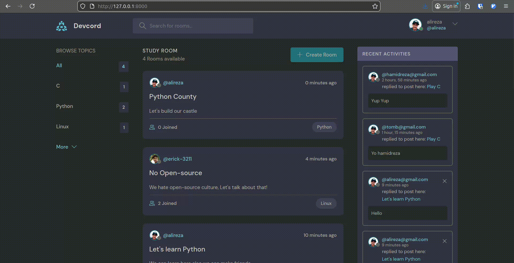

# Developers Discord

#### This is a website built with Django that gives you the ability to chat with other developers

## 🔗 Usage


## 💿 Technologies

- Python 3.12+
- Django 5.2+
- Django rest framework 3.16+
- Pillow 12+

## 🛠 Installation

1. Clone the repository
```shell
git clone https://github.com/Dimah-code/devcord.git
cd devcord/
```
2. Create a virtual environment
```shell
python -m venv venv
```
3. Enable it
```shell
source venv/bin/activate # Windows .\venv\Scripts\activate
```
4. Install dependencies
```shell
pip install -r requirements.txt
```
5. Run the migrations
```shell
python manage.py migrate
```
6. Create a superuser(Optional)
```shell
python manage.py createsuperuser
```
7.Run the server
```shell
python manage.py runserver
```
## 🤝 Contributing
Contributions are welcome! See also the [[Contributors guide](CONTRIBUTING.md)]
## 📝 License
This project is licensed under the [[MIT license](LICENSE)]